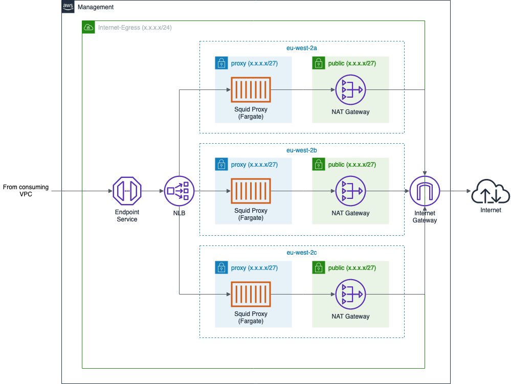
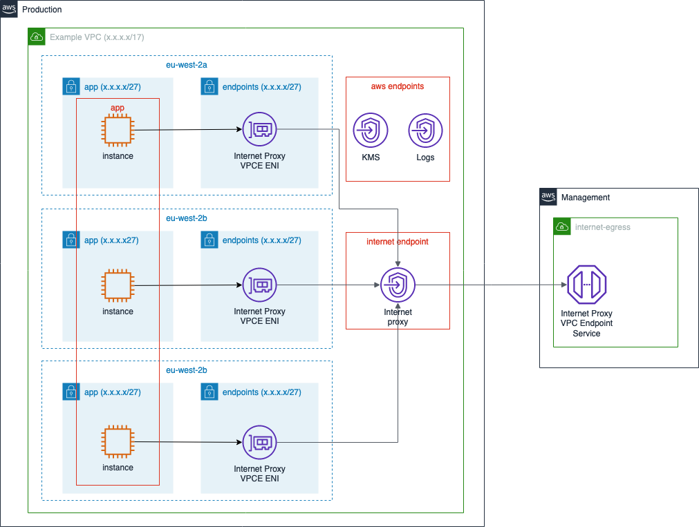

# Infrastructure for Internet Egress



The Internet Egress ECS service is fronted by a [PrivateLink](https://aws.amazon.com/privatelink/)
(VPC Endpoint Service) to enable consumers to easily connect to the proxies
without requiring complexities such as VPC peering or Transit Gateways.

Consumers should simply provision an Interface VPC Endpoint (much like they would
if consuming an AWS service like KMS) using the Endpoint Service's `service_name`. That service name is available as an output called
`outputs.internet_proxy_service.service_name`.

The recommended deployment pattern for a consumer is shown below:



### Key features/notes:

* VPC Endpoints can only be attached to a single subnet in each AZ. It's
  therefore recommended that VPC endpoints have a dedicated subnet in each
  VPC (the `endpoints` private subnet in the diagram above). This helps to keep
  valuable IP addresses free from "application" subnets. AWS' internal routing
  will enable traffic to reach those endpoints from any other subnet in the
  same VPC.
* The AWS endpoints also have ENIs in the `endpoints` subnet, but these aren't
  shown on the diagram to aid clarity for the Internet proxy flow.
* The `app` security group will need to allow egress traffic on TCP port 3128
  to the `internet endpoint` security group in order to reach the VPC endpoint
* The `internet endpoint` security group will need to allow ingress traffic on
  TCP port 3128 from the `app` security group
* The `internet proxy` VPC Endpoint needs to be configured to reach the
  Internet Proxy VPC Endpoint Service's service name. This service name is
  therefore output as `outputs.internet_proxy_service.service_name`.
* The proxy service consumers (the instances in the `app` subnets in the
  diagram above) will need to be configured to reach the proxy via the
  `internet proxy` VPC Endpoint's DNS addresses (note: specifically *not* the
  DNS addresses/service names of the VPC Endpoint Service in the management
  account).
* AWS have recently [announced](https://aws.amazon.com/about-aws/whats-new/2020/01/aws-privatelink-supports-private-dns-names-internal-3rd-party-services/)
  support for private DNS names for PrivateLink services. This would allow all
  consumers of the proxy to reach it via a friendly URL like `http://proxy.example.com:3128`. That feature isn't yet available in the Terraform AWS
  provider (see [#11510](https://github.com/terraform-providers/terraform-provider-aws/issues/11510)). Once the feature is available, we'll
  enable it on the VPC Endpoint Service in this repository and advise consumers
  to use that instead.

### Example Terraform

The following Terraform code provides an example implementation, because
sometimes code is easier to understand than words and pictures!

NB: The `internet_proxy` Subnet that is added here is provided as an example. Ideally this Custom
VPC Endpoint would sit in the same Subnet as the existing VPC Endpoints, therefore the `subnet_ids`
value would be pointing to the _existing_ VPC Endpoints Subnet. Most VPCs will not have room for (nor
do they require) an exclusive Subnet for this service.

```hcl

resource "aws_subnet" "internet_proxy" {
  count             = length(data.aws_availability_zones.available.names)
  cidr_block        = cidrsubnet(aws_vpc.example.cidr_block, 9, count.index)
  availability_zone = data.aws_availability_zones.available.names[count.index]
  vpc_id            = aws_vpc.example.id
}

resource "aws_security_group" "internet_proxy_endpoint" {
  name        = "internet_endpoint"
  description = "Control access to the Internet Proxy VPC Endpoint"
  vpc_id      = aws_vpc.example.id
}

resource "aws_security_group" "app" {
  name        = "app"
  description = "Control access to the App"
  vpc_id      = aws_vpc.example.id
}

resource "aws_vpc_endpoint" "internet_proxy" {
  vpc_id              = module.internal_compute_vpc.vpc.id
  service_name        = data.terraform_remote_state.internet_egress.outputs.internet_proxy_service.service_name
  vpc_endpoint_type   = "Interface"
  security_group_ids  = [aws_security_group.internet_proxy_endpoint.id]
  subnet_ids          = aws_subnet.internet_proxy.*.id
  private_dns_enabled = false
}

resource "aws_security_group_rule" "egress_internet_proxy" {
  description              = "Allow Internet access via the proxy"
  type                     = "egress"
  from_port                = 3128
  to_port                  = 3128
  protocol                 = "tcp"
  source_security_group_id = aws_security_group.internet_proxy_endpoint.id
  security_group_id        = aws_security_group.app.id
}

resource "aws_security_group_rule" "ingress_internet_proxy" {
  description              = "Allow proxy access from app"
  type                     = "ingress"
  from_port                = 3128
  to_port                  = 3128
  protocol                 = "tcp"
  source_security_group_id = aws_security_group.app.id
  security_group_id        = aws_security_group.internet_proxy_endpoint.id
}
```

At this point, services that want to reach the proxy can do so by hitting `http://${aws_vpc_endpoint.internet_proxy.dns_entry[0].dns_name}:3128`

### Example with Split VPCs/Repos
Some of our repositories are set up such that one repo/state file handles the
management of the VPC, then a secondary repo/statefile manages some of the
infrastructure that is deployed within that VPC. In this configuration, it's advised
that the Internet Proxy VPC Endpoint is placed in the internal-compute
repository (as per the example code above) and the full URL to the proxy is
made available as an output for other repositories to consume from. e.g.:

```hcl
output "internet_proxy" {
  value = {
    url = "http://${aws_vpc_endpoint.internet_proxy.dns_entry[0].dns_name}:3128"
    sg  = aws_security_group.internet_proxy_endpoint.id
  }
}
```

In this example, the aws-analytical-dataset-generation repo would be able to
consume that output as `data.terraform_remote_state.internal_compute.outputs.internet_proxy.url`.

It would also be able to create the required Security Group rules by referencing
the `data.terraform_remote_state.internal_compute.outputs.internet_proxy.sg` output.
